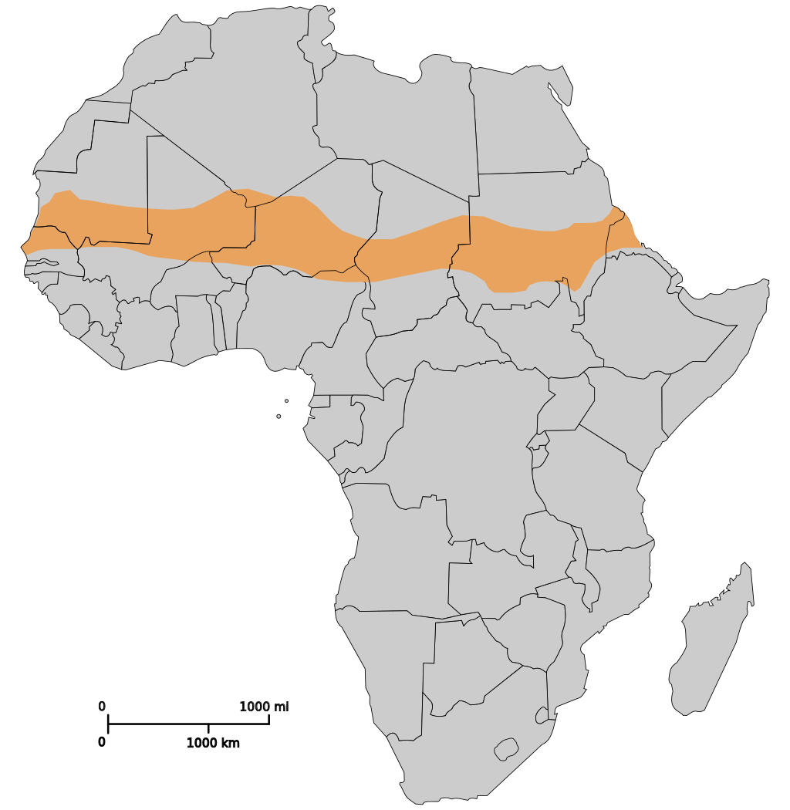
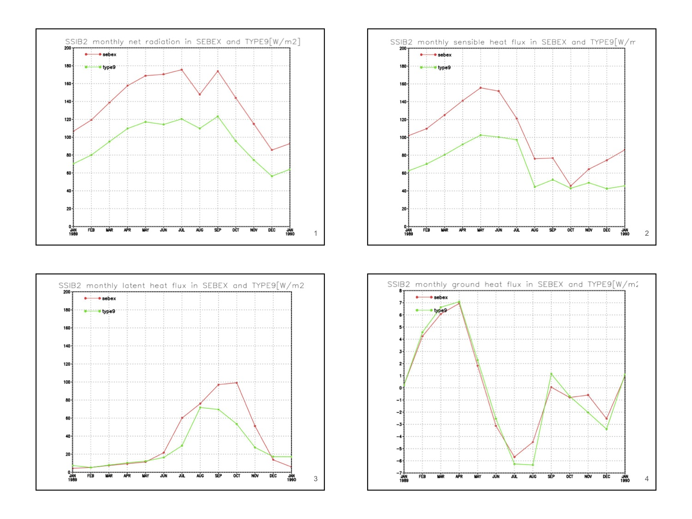
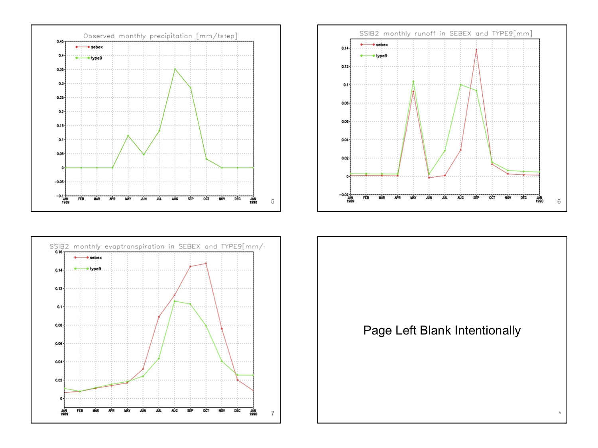
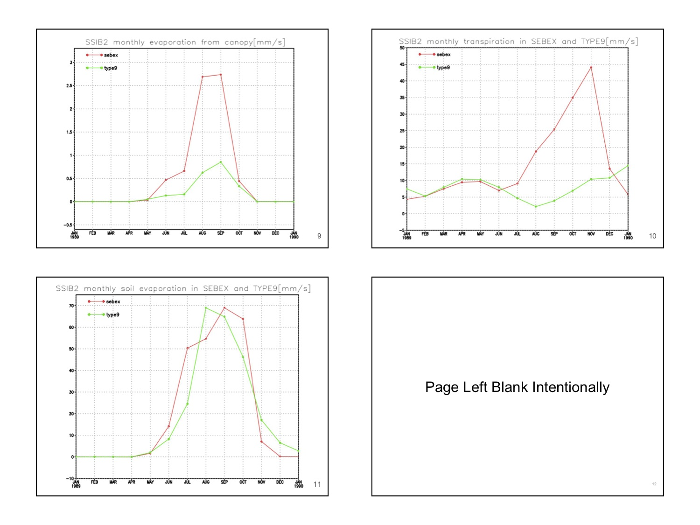
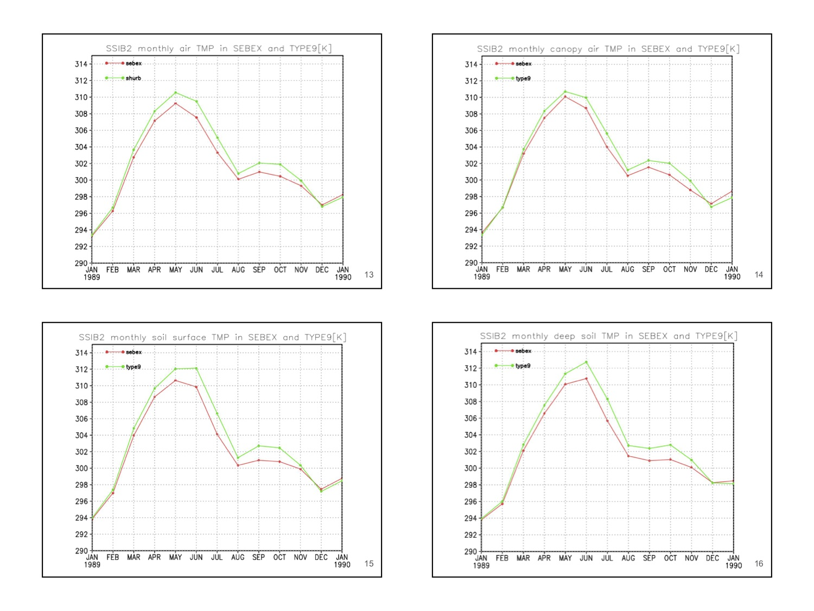
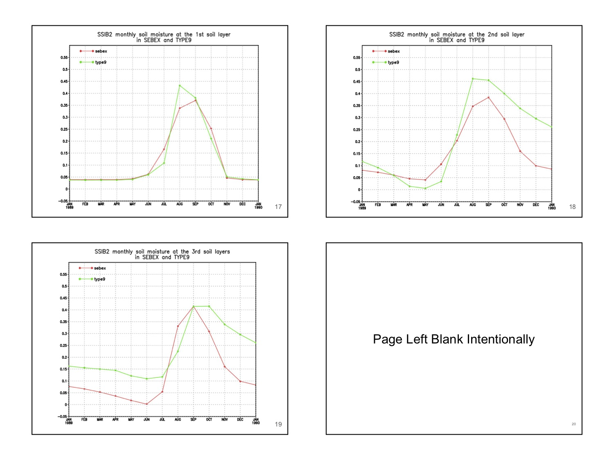
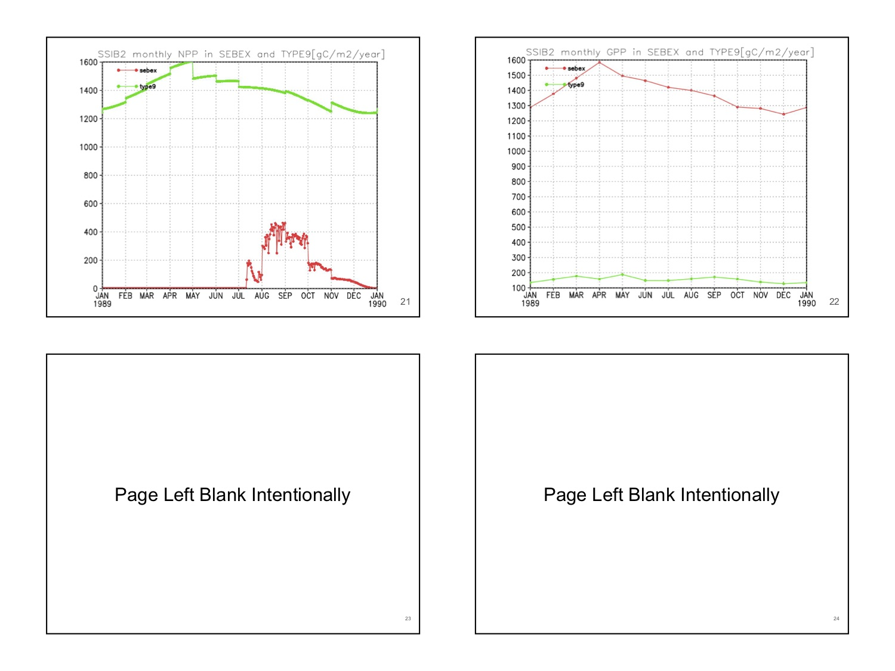
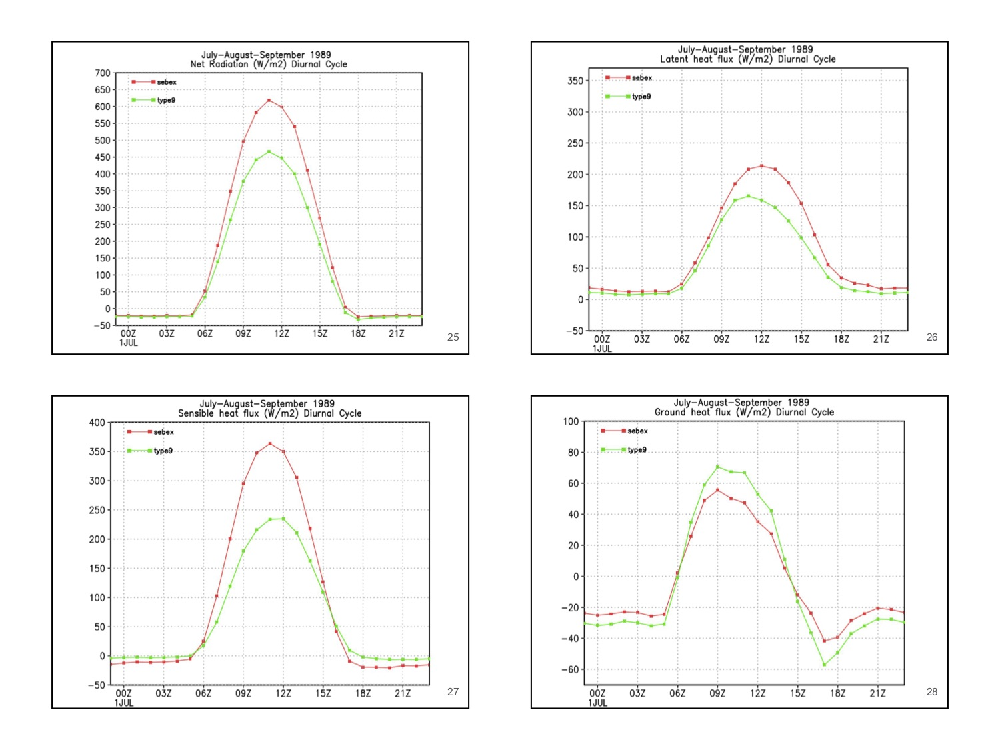
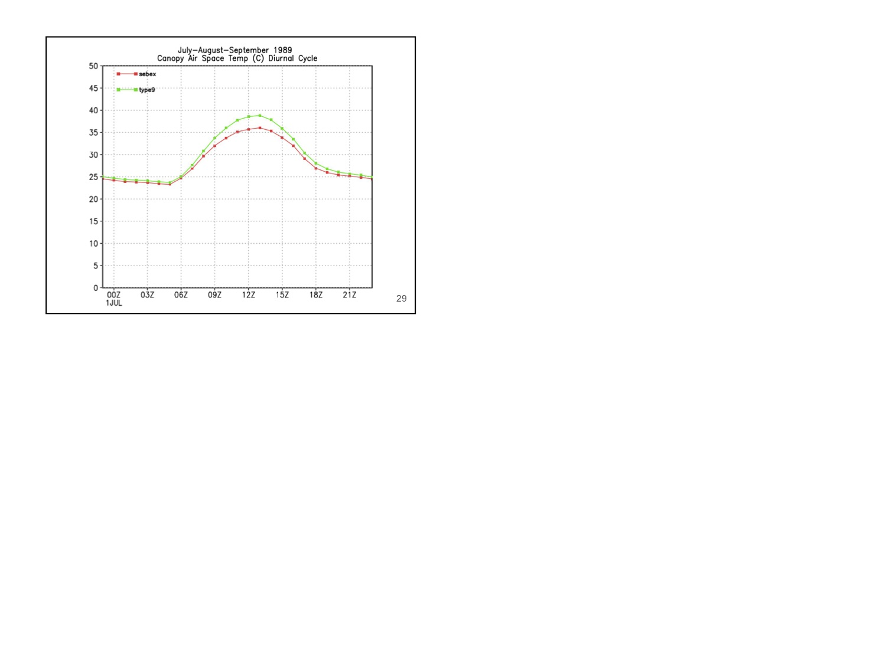

# Effects of Land Surface Degradation on Surface Water and Energy Balances

This study aims to test the effects of land surface degradation on surface water and energy balances in the Sahel. The control vegetation type used consists of shrubs with ground cover (SEBEX Data), while the experimental vegetation was changed to a degraded vegetation type of shrub with bare soil (Type 9 Data). The results indicate a large increase in the sensible heat flux, and significant changes in the water balance that can mostly be attributed to the evapotranspiration properties.

## Introduction

The Sahel, the study area under consideration, sits in the ecoclimatic zone in Africa between the Sahara and the Sudanian Savanna. The 5,400 kilometer belt of the Sahel region spans from the Atlantic Ocean to the Red Sea (see Figure 1 below).

This region contains many countries, cultures and varying geography. The grasslands of the Sahel provide the basis for livestock production, a major part of the economies of several Sahelian countries and the livelihoods of millions of people (Fensholt, 2013). Sadly, the historic famine, instability, and violence in the region may be attributed to the mega-droughts it frequently experiences.

The Sahel region is characterized by a semi-arid (using the Köppen climate classification) and highly variable climate. The Sahel has a tropical, hot steppe, and somewhat windy climate with a high sunshine duration year-round, between 2,700 hours and 3,500 hours (more than 79% of the daylight hours). The region typically experiences an intense rainy season during July - August - September (JAS) and prolonged dry seasons (Giannini, 2008), though in the second half of the 20th century the Sahel underwent a drastic shift in climate. An abundant period of rain in the 1950's and 1960's gave way to a progressively drier period in the 1970's and early 1980's. Around the late 1980s, summer rainfall in the Sahel had been increasing, and with it vegetation. This new trend has been called the 'greening' of the Sahel. Although this partial recovery occurred around 1980, the most recent drought occurred very recently, in 2012.

These persistent drought periods that occurred were initially attributed to human mismanagement of land resources, such as the expansion of agriculture into marginal zones, overgrazing, and woodcutting for fuel (Giannini, 2008). The first theories claimed that anthropogenic activity affected the vegetation cover and made the savanna desert-like, and that the regional atmospheric circulation had perpetuated that change. Major dust storms have ravaged the region over the last century, as woodlands disappeared with the rise of population and industrialization. While anthropogenic effects are undeniable, more recent studies have begun to explore alternative causal effects. Now, the anthropogenic causes explored are not related to mismanagement of land resources at the regional scale, but rather to the larger scale land transformation. It is now accepted that changes to the land surface affect the surface energy balance, exchanges of water, and heat, it is necessary to develop analytical tools to examine whether a process may be significant. The large role that land and atmosphere interactions play in determining the Sahel’s sensitive climate calls for a deeper understanding.

## Experimental Design

This study aims to test the effects of land surface degradation on surface water and energy balances. The control vegetation type used consists of shrubs with ground cover, while the experimental vegetation was changed to a degraded vegetation type of shrub with bare soil classified as Type 9 (see Table 1). The experimental design is set-up in a way that a meaningful comparison can be made between the two vegetation types.

Table 1: Type 9 Vegetation Parameters

| Surface Albedo | Roughness Length (m) | Leaf Area Index | Greeness | Rs min | Vegetation Cover | Soil Depth (m) | Ks (m/s) | Wilting Point |
| --- | --- | --- | --- | --- | --- | --- | --- | --- |
| 0.28 | 0.06 | 0.31 | 0.71 | 1041 | 0.1 | 1.5 | 1.76E-04 | 0.09 |

The control vegetation data used is field measurements provided by the Institute of Hydrology (IH) and the International Crop Research Institute for the Semi-Arid Tropics (ICRISAT) Sahelian Center. The data collected by the collaborating institutes is from a semiarid site in Niger under the project title of the Sahelian Energy Balance Experiment or SEBEX (Xue, 1998). The Sahelian Center obtains direct measurements of available energy, evaporation and sensible heat flux from contrasting Sahelian land types in order to see how they might be affected by a change in vegetation (Wallace, 1991).

The data collected for the experimental vegetation is from within the framework of a global terrestrial biosphere model called the Simplified Simple Biosphere Model version 2.0, or SSiB2. In this experiment, the comparison land of Type 9 is selected to simulate a degraded land type previously classified as Type 6 (Savanna) or Type 8 (shrubs with ground cover). The type selected is one of twelve vegetation types recognized by SSiB2, including trees, short vegetation, arable crops, and desert (Xue & Fennessy, 2002).

## Results

The following figures illustrate the difference in the two cases of different vegetation types in terms of energy balance, water balance, temperature, soil moisture, plant productivity, and diurnal variation.

### Energy Balance

The monthly mean net radiation (1), latent heat (2), sensible heat (3), and ground heat fluxes (4) for the one-year simulation can be seen below.

Table 2: The Impact Of Land Degradation On Energy Balance in JJAS

| Energy Balance | SEBEX | TYPE9 | Δ (TYPE9-SEBEX) |
| -------------- | ----- | ----- | --------------- |
| Net Radiation | 166.835 | 116.91 | -49.925 |
| Upward Longwave | 484.546 | 496.718 | 12.172 |
| Latent Heat | 63.7786 | 46.8371 | -16.9415 |
| Sensible Heat | 106.39 | 73.6195 | -32.7705 |
| Ground Heat | -3.33375 | -3.54638 | -0.21263 |

#### Water Balance

The monthly mean precipitation (5), runoff (6), and evapotranspiration (7) for the one-year simulation can be seen below.

The monthly mean evaporation from canopy (9), transpiration (10), and soil evaporation (11) for one-year simulation can be seen below.

Table 3: The Impact Of Land Degradation On Water Balance in JJAS

| Water Balance | SEBEX | TYPE9 | Δ (TYPE9-SEBEX) |
| ------------- | ----- | ----- | --------------- |
| Interception Loss | 1.63857 | 0.44068 | -1.19789 |
| Transpiration | 15.018 | 4.63907 | -10.37893 |
| Soil Evaporation | 47.1215 | 41.7566 | -5.3649 |
| Evapotranspiration | 0.0945522 | 0.0693875 | -0.0251647 |
| Runoff | 0.0411157 | 0.0562243 | 0.0151086 |

#### Temperature

The monthly mean temperature at air space (13), canopy air space (14), soil surface (15), and deep soil (16) for a one-year simulation can be seen below.

Table 4: The Impact Of Land Degradation On Temperature in JJAS

| Temperature | SEBEX | TYPE9 | Δ (TYPE9-SEBEX) |
| ----------- | ----- | ----- | --------------- |
| Canopy Air Temperature | 302.959 | 304.338 | 1.379 |
| Soil Surface Temperature | 303.793 | 305.66 | 1.867 |
| Deep Soil Temperature | 304.678 | 306.51 | 1.832 |

#### Soil Moisture

The monthly mean soil moisture at layer 1 (17), layer 2 (18), and layer (19) for the one-year simulation can be seen below.

Table 1: The Impact Of Land Degradation On Soil Moisture in JJAS

| Soil Moisture | SEBEX | TYPE9 | Δ (TYPE9-SEBEX) |
| ------------- | ----- | ----- | --------------- |
| 1st Soil Layer | 0.234445 | 0.246063 | 0.011618 |
| 2nd Soil Layer | 0.260472 | 0.29556 | 0.035088 |
| 3rd Soil Layer | 0.200675 | 0.215837 | 0.015162 |

#### Productivity

The Net Primary Productivity (21), and Gross Primary Productivity (22) for the one- year simulation can be seen below.

#### Diurnal Variation

The July-August-September (JAS) mean of diurnal variations of net radiation (25), latent heat (26), sensible heat (27), ground heat fluxes (28) and temperature at canopy airspace (29) can be seen below.

## Discussions

The results demonstrate a large difference in the June-July-August-September (JJAS) mean energy balance (\-49.93 W/m2) between the two vegetation types over the simulation period (see tables below). Most of the difference may be attributed to the sensible heat flux (\-32.77 W/m2) component of the budget, with about half as much coming from the latent heat (-16.94 W/m2), and little to no change in ground heat flux (-0.21 W/m2). The diurnal variation in the energy budget exhibits a similar pattern, with the sensible heat flux component accounting for a majority of the difference between the two vegetation types. The upward longwave radiation is the only component that increases with the degraded land cover (+12.17 W/m2).

While the precipitation data for the two vegetations is identical in this case, the overall water balance shows some variation with land cover type. The JJAS mean evaporation from the canopy (interception loss) shows a 73% decrease (-1.20 W/m2). Transpiration (-10.38 W/m2) and soil evaporation (-5.37 W/m2) also sharply decrease with the change in land cover. There is little to no change in the runoff volumes. While the results in the previous section appear conclusive, there are some considerations and errors involved. The output units for precipitation, evapotranspiration, and runoff should be mm/hour. The units for transpiration, soil evaporation, and interception loss should be in W/m2 ( the conversion factor from W/m2 to mm / hour is: `(W/m2) x ( 0.0345 / 24.0 ) = ( mm / hour )`.

The JJAS mean temperature at the canopy air space (1.38 K), soil surface (1.87 K), and deep soil (1.83 K) for the simulation period show a slight increase. While the change in temperature appears marginal, even a small increase may upset the delicate agricultural climate of the Sahel region and create a positive feedback loop. The diurnal variation in  canopy air space temperature shows a more significant change of a few degrees celsius at the peak time of day, and almost no change during nighttime.

It has been deduced that soil moisture is one of the more important land environmental variables, relative to land surface climatology, and hydrology (Goward, 2002). Variations in soil moisture produce significant changes in surface energy balance, regional runoff, and vegetation productivity (Goward, 2002). The JJAS mean soil moisture at the first layer (0.012), second layer (0.035), and third layer (0.015) for the simulation period show a slight increase, with the second layer dominating in change. For soil moisture to contribute to precipitation predictability, two things must happen, a soil moisture anomaly must be “remembered” into the forecast period, and the atmosphere must respond in a predictable way to the remembered soil moisture anomalies (Xue, 2017).

The Net Primary Productivity (NPP), the amount of carbon uptake after subtracting Plant Respiration (RES) from Gross Primary Productivity (GPP), shows unreasonably large variation with land cover change. The Gross Primary Productivity (GPP), which is the total rate at which the ecosystem captures and stores carbon as plant biomass for a given length of time, also shows unreasonable patterns. Unfortunately, the GPP and NPP output in SSiB2 exhibit some problems due to faulty Fortran 77 code. The GPP and NPP results must therefore be ignored in the conclusion of this study.

## Conclusions

The characteristics of the diurnal and seasonal variations of these variables, as well as the energy and water partitioning under different land cover conditions exhibit differences over the year long simulation. The July-August-September (JAS) mean energy balances and water balance from the model simulation for the different vegetation types typically reflect the same increase or decrease patterns. The key takeaways include:

- Change in energy balance is mostly dictated by the sensible heat flux.
- Change in the water balance can be mostly attributed to the evapotranspiration properties.
- Change in soil moisture content mostly occurred in the second layer.
- The temperatures at the land \- atmosphere boundary layer show a slight, yet potentially serious increase.

In the future, more realistic land surface models and changes in land-surface conditions will help improve the understanding of the mechanisms of land–atmosphere interactions in this region.

## References

Clark, Douglas B., et al. "Modeling the impact of land surface degradation on the climate of tropical North Africa." Journal of Climate 14.8 (2001): 1809-1822.

Fensholt, Rasmus, et al. "Assessing land degradation/recovery in the African Sahel from long-term earth observation based primary productivity and precipitation relationships." Remote Sensing 5.2 (2013): 664-686.

Giannini, Alessandra, Michela Biasutti, and Michel M. Verstraete. "A climate model-based review of drought in the Sahel: desertification, the re-greening and climate change." Global and planetary Change 64.3-4 (2008): 119-128.

Goward, Samuel N., Yongkang Xue, and Kevin P. Czajkowski. "Evaluating land surface moisture conditions from the remotely sensed temperature/vegetation index measurements: An exploration with the simplified simple biosphere model." Remote sensing of environment 79.2-3 (2002): 225-242.

Kahan, D, Y. Xue, and S. Allen, 2006: The impact of vegetation/soil parameters in simulations of surface energy and water balance in the semi-arid Sahel area: a case study using SEBEX and HAPEX-Sahel data. J. Hydrology.

Nicholson, Sharon E., Compton J. Tucker, and M. B. Ba. "Desertification, drought, and surface vegetation: an example from the West African Sahel." Bulletin of the American Meteorological Society 79.5 (1998): 815-829.

Taylor, Christopher M., et al. "The influence of land use change on climate in the Sahel." Journal of Climate 15.24 (2002): 3615-3629.

Wallace, J. S., et al. "The Sahelian Energy Balance Experiment (SEBEX): Ground based measurements and their potential for spatial extrapolation using satellite data." Advances in Space Research 11.3 (1991): 131-141.

Xue, Yongkang, and Jagadish Shukla. "The influence of land surface properties on Sahel climate. Part 1: Desertification." Journal of climate 6.12 (1993): 2232-2245.

Xue, Yongkang, and Jagadish Shukla. "The influence of land surface properties on Sahel climate. Part II. Afforestation." Journal of Climate 9.12 (1996): 3260-3275.
